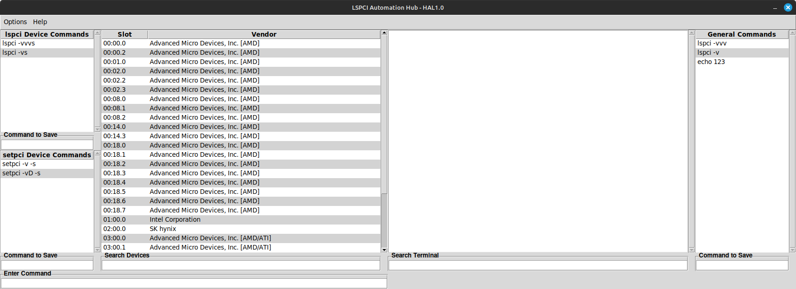

# lspci/setpci Automation Hub

## Overview
Welcome to the LSPCI/SETPCI Automation Hub - a graphical user interface for managing PCI devices using 'lspci' and 'setpci' commands. It provides and intuative way to explore PCI devices that are connected to the motherboard, view the information about them, and modify their settings with ease.

## Features
- **Explore PCI Devices**: Provides and easy way to view all of the PCI slots connected to a device.
- **View Device Details**: Get detailed information about each PCI device, including vendor and device ID's, driver information and more.
- **Modify PCI Settings**: Allows easy reading and writing to the configuration regiesters of PCI, with a user friendly interface.
- **Save/Load Commands**: Effortlessly save and load previous commands to CSV files, allowing you to start off from where you left off, and sharing your commands between other intelligent people like yourself ;).
- **Filter**: Easily filter out the devices that you don't need, to focus on what matters.
- **Highlighting**: Hilight keywords that are relevent to what you need to know about a specific device.
- **sudo**: Acquire the power of super user by entering your 'sudo' password, to see the full details of a PCI device.
- **Help**: If you ever are looking for a guide on using the application, click on the help menu bar at the top of the window.
